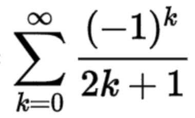

# pi_calculation
Pi calculated with infinite series. It uses leibniz pi formula times 4. 

Run in linux using python piX.py. 
Also an interesting correlation where error is equal to 1/n. Why that happens? I cannot say. But 4 times 
gets you an error bound of 1/n. Try pi5.py. 
